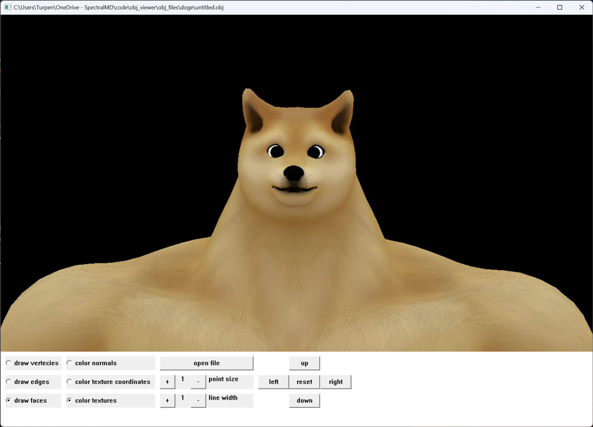
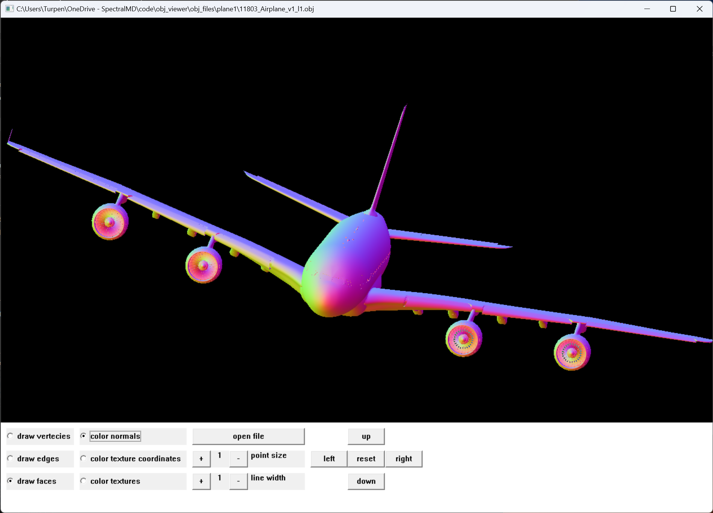
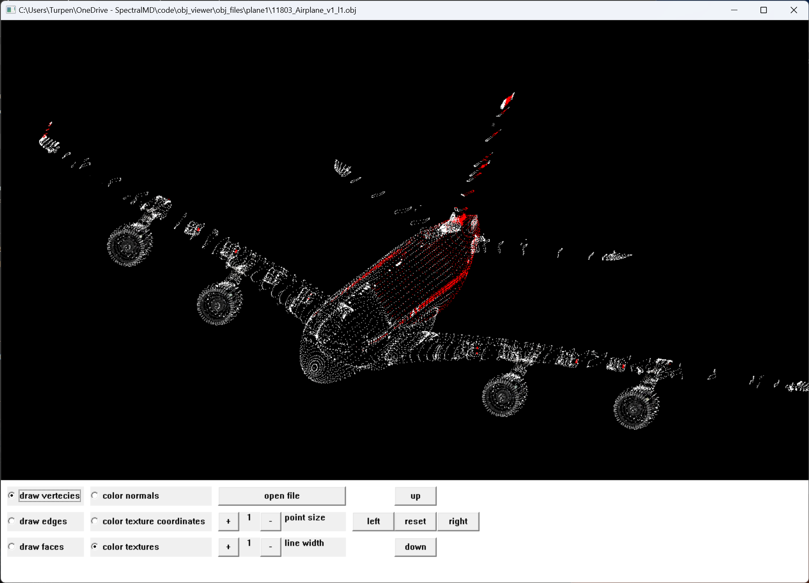
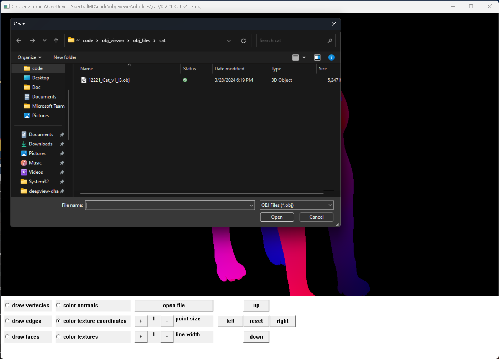

# 3D Model Viewer

## Features

* click and drag to rotate (this is done with quaternions so there is no gymbal lock)
* right-click and drag to pan, or use the buttons to pan
* press button to open an explorer window for selecting a file to load
* color model with textures, normal vectors, or texture coordinates
* draw model as a wireframe, as a point cloud vertecies, or as faces
* any combination of color mode and draw mode can be used
* line width and point size are configurable when viewing wireframes or point clouds
* if the model doesn't contain normal vectors, the app will generate them on the fly

## Limitations

* only works for Wavefront OBJ files (.obj)
* textures must be .bmp files (if they aren't, open them then save as bmp, then change the file names in the .mtl file)
* only works on windows
* window can't be resized
* doesn't support Blin-Phong shading parameters that are often stored in .mtl files

## Examples

### Color with textures

### Color with texture coordinates

### Color with normal vectors

### Wireframe mode

### Vertex point cloud mode

### Explorer window for opening new files

## Whats the point?

This app has zero runtime dependencies.  It only uses The Win32 API and OpenGL 1.1 which are included in all windows systems.
The only build time dependency is GLM which is a header only library for vectors and matricies.
The goal was to understand 3d models better.  File parsing for .obj, .mtl, and .bmp were all done from scratch.

What else I learned:
* How to implement an intuitive quaternion based click and drag rotation system
* How to implement panning the same ways as Mircsoft's "3D Viewer" app 
* How to open a file selection dialog window with Windows Shell API 
* How radio buttons work in Win32